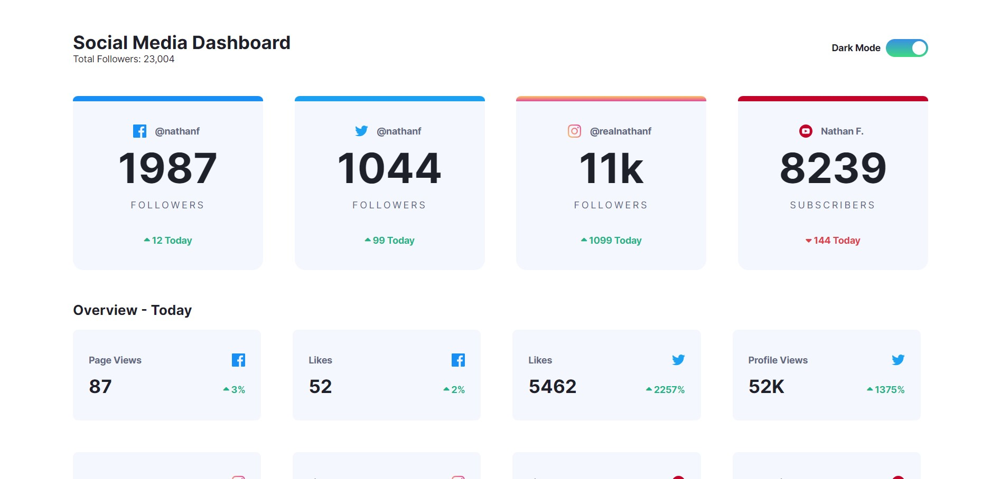

# Frontend Mentor - Social media dashboard with theme switcher solution

This is a solution to the [Social media dashboard with theme switcher challenge on Frontend Mentor](https://www.frontendmentor.io/challenges/social-media-dashboard-with-theme-switcher-6oY8ozp_H). Frontend Mentor challenges help you improve your coding skills by building realistic projects. 

## Table of contents

- [Overview](#overview)
  - [The challenge](#the-challenge)
  - [Screenshot](#screenshot)
  - [Links](#links)
- [My process](#my-process)
  - [Built with](#built-with)
  - [Continued development](#continued-development)
- [Author](#author)

## Overview

### The challenge

Users should be able to:

- View the optimal layout for the site depending on their device's screen size
- See hover states for all interactive elements on the page
- Toggle color theme to their preference

### Screenshot

### Links

- Solution URL: [You are already here](https://github.com/Techkie-Creations/social-media-dashboard-frontendmentor)
- Live Site URL: [Social Media Dashboard Frontend Mentor](https://techkie-creations.github.io/social-media-dashboard-frontendmentor)

## My process

### Built with

- Semantic HTML5 markup
- CSS custom properties
- Flexbox
- Grid
- Desktop-first workflow
- [jQuery](https://jquery.com) - JS Library
- [GSAP](https://gsap.com) - JS Animation Library

### Continued development

Might make it dynamic depending on the data fed to it.. will be able to feed it data via an upload input, will support both JSON and XML files.

## Author

#### Techkie Creations

- Frontend Mentor - [@Techkie-Creations](https://www.frontendmentor.io/profile/Techkie-Creations)
- Codepen - [@Techkie-Creations](https://codepen.io/Tech--Guy)
- LinkedIn - [@stefan-ngago](https://www.linkedin.com/in/stefan-ngago)